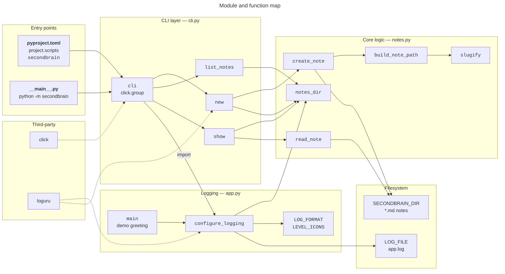
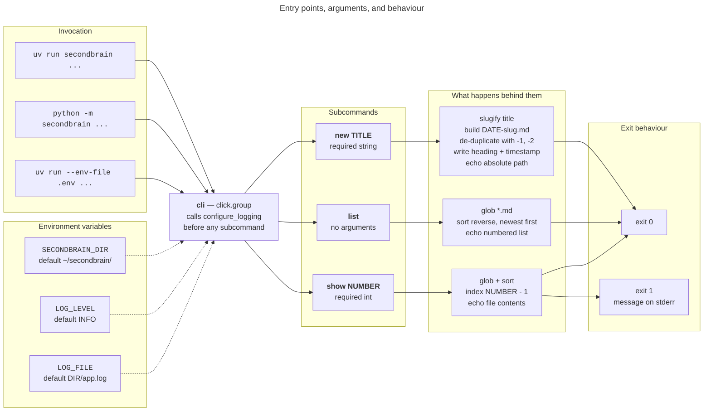
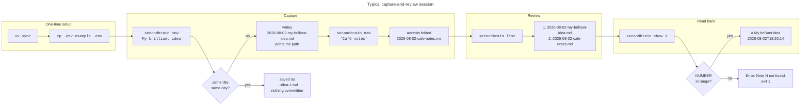

# Architecture

Three views of `secondbrain`: how the modules fit together, what the entry points
accept, and what a typical session looks like.

## 1. Package map

Modules, the functions they export, and the direction of every import. The package
is a straight three-layer stack — the CLI depends on logging and notes, logging
depends on notes, and `notes.py` depends on nothing but the standard library.

!!! note "Reading the edges"
    Solid arrows are calls or command registrations; dotted arrows are third-party
    libraries providing the machinery. `notes.py` sits at the bottom with no
    internal dependencies, which is why it is the easiest module to test and extend.

## 2. Entry points and arguments

Every way into the program converges on the same Click group. Configuration is read
from the environment on each call, so nothing is frozen at import time.

!!! warning "Missing directory is handled differently per command"
    `list` prints a plain message and still exits 0. `show` treats the same
    situation as an error: message on stderr, exit code 1. `new` never hits the
    case at all, because it creates the directory on the way through.

## 3. Example user flow

A first session: capture two ideas, look at what is stored, read one back.

!!! tip "Numbering is positional, not permanent"
    `list` numbers notes newest-first each time it runs, so a number is only valid
    until the next note is created. Re-run `list` before `show` if anything has
    changed in between.
